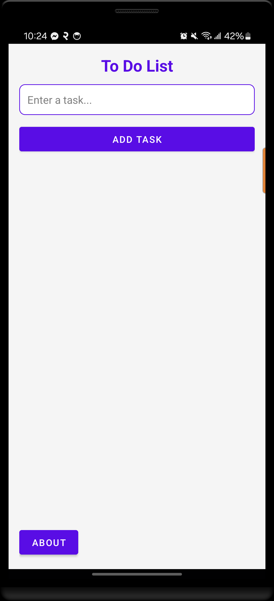
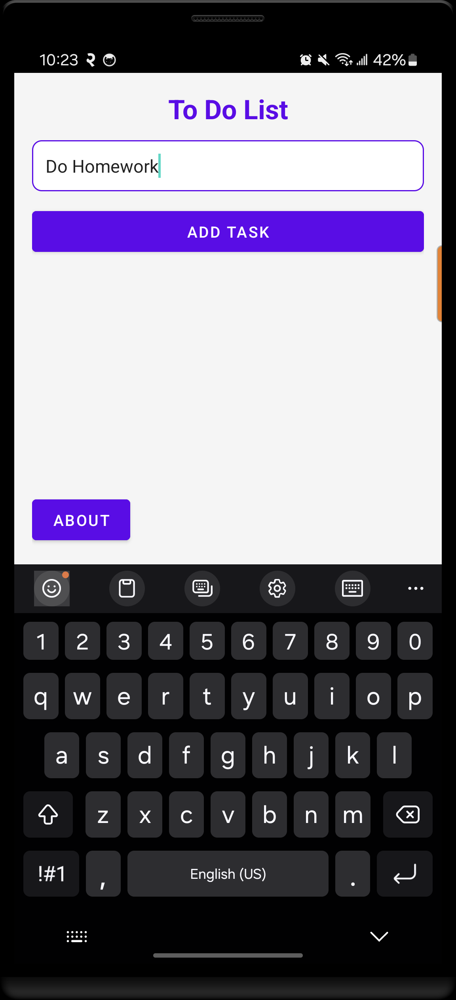
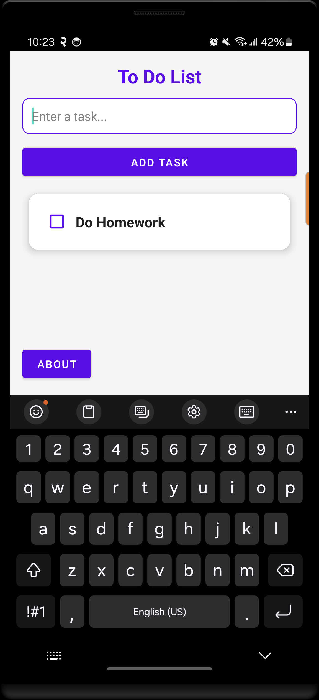
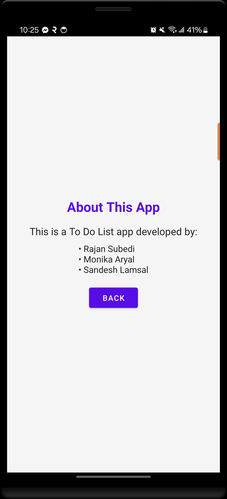

# ToDo List App

## Introduction
ToDo List App is a mobile application developed as part of a mobile app development assignment. The application allows users to efficiently manage their tasks by adding, updating, and deleting them. It provides a simple and user-friendly interface to enhance productivity. The app supports data persistence, ensuring that tasks remain saved even if the user closes the application.

## Screenshots

### Home Page

### Adding Task

### Task Added

### Deleting Task

### About

## Technology Used
- Kotlin
- Android Studio
- MVVM Architecture
- Room Database
- Jetpack Compose (if applicable)
- Hilt for Dependency Injection

## Team Members
- Rajan Subedi
- Monika Aryal
- Sandesh Lamsal

